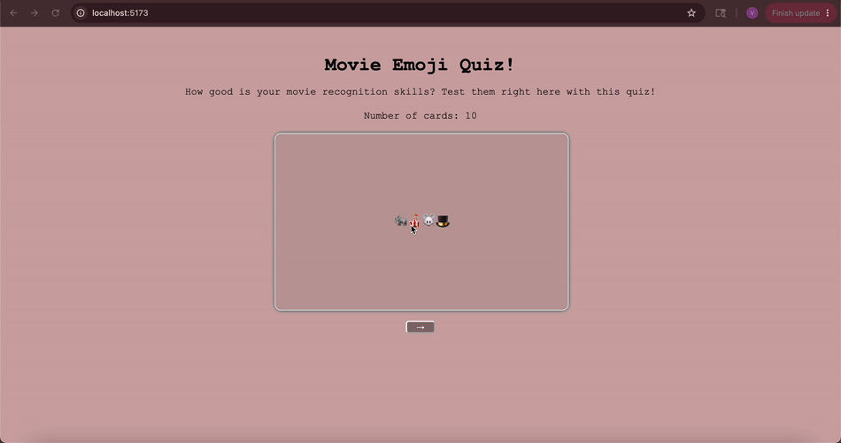

# Web Development Project 2 - *Emoji Movie Flashcards*

Submitted by: **Vanessa Balbuena**

This web app: **If you want to test your knowledge on movies from a series of emojis, this is a fun quiz you can take!**

Time spent: **3-4** hours spent in total

## Required Features

The following **required** functionality is completed:

- [X] **The app displays the title of the card set, a short description, and the total number of cards**
  - [X] Title of card set is displayed 
  - [X] A short description of the card set is displayed 
  - [X] A list of card pairs is created
  - [X] The total number of cards in the set is displayed 
  - [X] Card set is represented as a list of card pairs (an array of dictionaries where each dictionary contains the question and answer is perfectly fine)
- [X] **A single card at a time is displayed**
  - [X] Only one half of the information pair is displayed at a time
- [X] **Clicking on the card flips the card over, showing the corresponding component of the information pair**
  - [X] Clicking on a card flips it over, showing the back with corresponding information 
  - [X] Clicking on a flipped card again flips it back, showing the front
- [X] **Clicking on the next button displays a random new card**

The following **optional** features are implemented:

- [ ] Cards contain images in addition to or in place of text
  - [ ] Some or all cards have images in place of or in addition to text
- [ ] Cards have different visual styles such as color based on their category
  - Example categories you can use:
    - Difficulty: Easy/medium/hard
    - Subject: Biology/Chemistry/Physics/Earth science

The following **additional** features are implemented:

* [ ] List anything else that you added to improve the site's functionality!

## Video Walkthrough

Here's a walkthrough of implemented required features:

<!-- Replace this with whatever GIF tool you used! -->
GIF created with ...  

[Kap](https://getkap.co/) for macOS

<!-- Recommended tools:

[ScreenToGif](https://www.screentogif.com/) for Windows
[peek](https://github.com/phw/peek) for Linux. -->

## Notes

Describe any challenges encountered while building the app.

Most of the material I understood but i was having a little trouble when i had to animate the card to flip. To help me get through this blocker I used Claude to help me.

## License

    Copyright [yyyy] [name of copyright owner]

    Licensed under the Apache License, Version 2.0 (the "License");
    you may not use this file except in compliance with the License.
    You may obtain a copy of the License at

        http://www.apache.org/licenses/LICENSE-2.0

    Unless required by applicable law or agreed to in writing, software
    distributed under the License is distributed on an "AS IS" BASIS,
    WITHOUT WARRANTIES OR CONDITIONS OF ANY KIND, either express or implied.
    See the License for the specific language governing permissions and
    limitations under the License.

# Web Development Project 3 

Time spent: **2-3** hours spent in total

## Required Features

The following **required** functionality is completed:

- [X] **The user can enter their guess into an input box *before* seeing the flipside of the card**
  - Application features a clearly labeled input box with a submit button where users can type in a guess
  - Clicking on the submit button with an **incorrect** answer shows visual feedback that it is wrong 
  -  Clicking on the submit button with a **correct** answer shows visual feedback that it is correct
- [X] **The user can navigate through an ordered list of cardss**
  - A forward/next button displayed on the card navigates to the next card in a set sequence when clicked
  - A previous/back button displayed on the card returns to the previous card in the set sequence when clicked
  - Both the next and back buttons should have some visual indication that the user is at the beginning or end of the list (for example, graying out and no longer being available to click), not allowing for wrap-around navigation

The following **optional** features are implemented:

- [X] Users can use a shuffle button to randomize the order of the cards
  - Cards should remain in the same sequence (**NOT** randomized) unless the shuffle button is clicked 
  - Cards should change to a random sequence once the shuffle button is clicked
- [X] A user’s answer may be counted as correct even when it is slightly different from the target answer
  - Answers are considered correct even if they only partially match the answer on the card 
  - Examples: ignoring uppercase/lowercase discrepancies, ignoring punctuation discrepancies, matching only for a particular part of the answer rather than the whole answer
- [ ] A counter displays the user’s current and longest streak of correct responses
  - The current counter increments when a user guesses an answer correctly
  - The current counter resets to 0 when a user guesses an answer incorrectly
  - A separate counter tracks the longest streak, updating if the value of the current streak counter exceeds the value of the longest streak counter 
- [ ] A user can mark a card that they have mastered and have it removed from the pool of displayed cards
  - The user can mark a card to indicate that it has been mastered
  - Mastered cards are removed from the pool of displayed cards and added to a list of mastered cards

The following **additional** features are implemented:

* [ ] List anything else that you added to improve the site's functionality!

## Video Walkthrough

Here's a walkthrough of implemented user stories:

<!-- Replace this with whatever GIF tool you used! -->
GIF created with ...  
[Kap](https://getkap.co/) for macOS

<!-- Recommended tools:
[ScreenToGif](https://www.screentogif.com/) for Windows
[peek](https://github.com/phw/peek) for Linux. -->

## Notes

Describe any challenges encountered while building the app.

## License

    Copyright [yyyy] [name of copyright owner]

    Licensed under the Apache License, Version 2.0 (the "License");
    you may not use this file except in compliance with the License.
    You may obtain a copy of the License at

        http://www.apache.org/licenses/LICENSE-2.0

    Unless required by applicable law or agreed to in writing, software
    distributed under the License is distributed on an "AS IS" BASIS,
    WITHOUT WARRANTIES OR CONDITIONS OF ANY KIND, either express or implied.
    See the License for the specific language governing permissions and
    limitations under the License.